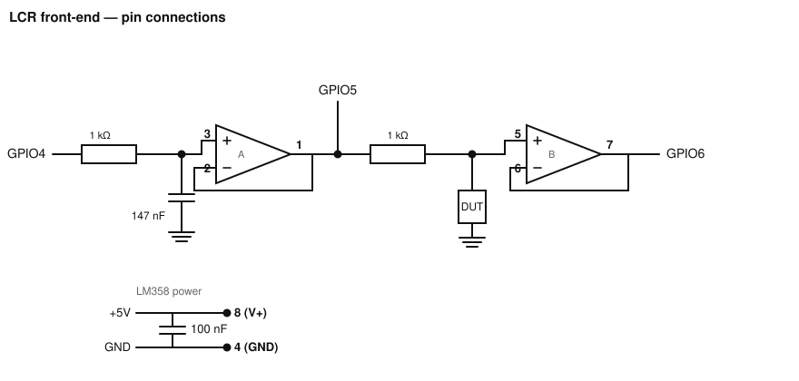

# LCR Meter — LilyGo TTGO T-Display port

> **This is the `ttgo-t-display` branch**, a port of the TinyS3 + SSD1306 fork to a
> **LilyGo TTGO T-Display** board:
> - **Board:** LilyGo **TTGO T-Display** — a **classic ESP32** (ESP32-D0WDQ6-V3,
>   rev v3.0) instead of the ESP32-S3 TinyS3.
> - **Display:** the board's **built-in ST7789 colour TFT (240×135, SPI)** instead
>   of the I²C SSD1306 OLED. No external display to wire.
> - **PWM pin:** moved to **GPIO26** — the TinyS3's GPIO4 is the T-Display's TFT
>   backlight and can't be reused.
> - **ADC pins:** the firmware samples `ADC1_CH4`/`ADC1_CH5`, which on the classic
>   ESP32 are **GPIO32 (Vin)** and **GPIO33 (Vout)** — so only the wiring changes,
>   not the sampling code.
> - **Filter cap:** still **147 nF** (100 nF ∥ 47 nF); a single 150 nF also works.
>
> Original project: `<add upstream repo URL here>` — credit to the original author.
> See [Acknowledgements](#acknowledgements).

## Description
A fully functional LCR meter (Inductance, Capacitance, Resistance) built around a
classic ESP32. The system uses Digital Signal Processing (DSP) to calculate component
values by analyzing the voltage and phase differences across a known reference
resistor and the Device Under Test (DUT).

## Features
- **Custom Sine Wave Generation:** A 100 kHz PWM carrier is filtered into a clean
  1 kHz sine wave stimulus.
- **Precision Sampling:** ADC sampling runs on a dedicated FreeRTOS task pinned to
  Core 0, eliminating OS jitter. Vin and Vout are sampled alternately (20 kHz tick
  → 10 kHz per channel) with a fixed, compensated skew.
- **DSP Architecture:** Implements the Goertzel algorithm for efficient single-bin
  Discrete Fourier Transform (DFT) amplitude and phase extraction.
- **Adaptive Hybrid Filtering:** A custom median filter with a dynamic phase target
  compensates for physical component imperfections (ESR/DCR) and hardware noise.
- **Standalone Operation:** Real-time classification and measurement on the
  built-in ST7789 colour TFT (240×135), rendered flicker-free via a sprite back-buffer.
- **Robust Error Handling:** Automatic hardware-level detection of missing
  components, open circuits, or an unpowered op-amp.

## How it works (signal chain)
1. **GPIO26** emits a 100 kHz PWM whose duty cycle is stepped through a 100-point
   sine table at a 100 kHz interrupt rate → one sine period per 1 ms → **1 kHz**.
2. An **RC low-pass filter** turns the PWM into a smooth 1 kHz sine (still DC-coupled,
   centred around ~1.65 V).
3. **LM358 buffer A** (voltage follower) drives the sine into the voltage divider.
   Its output is the **Vin** node, sampled by **GPIO32** (ADC1_CH4).
4. The divider is `Vin → R_ref → Vout → DUT → GND`. **Vout** is the voltage across
   the DUT.
5. **LM358 buffer B** isolates the Vout node and feeds **GPIO33** (ADC1_CH5).
6. Firmware computes `Z_DUT = R_ref · Vout / (Vin − Vout)` (complex), extracts
   magnitude and phase via Goertzel, classifies R/L/C by phase sign, and shows the
   result on the TFT.

The DSP works on the **ratio** Vout/Vin, so the absolute sine amplitude (and hence
the exact filter-cap value) is not critical — which is why the 147 nF substitution
is harmless.

> **Board photo:** [T-display_1024x1024.jpg.webp](T-display_1024x1024.jpg.webp).
> The 240×135 TFT, its two push-buttons and the USB-C port sit on the front; all
> exposed GPIOs are on the two side headers (see the table below).

---

## 1) Parts list

| Qty | Part | Notes |
|----:|------|-------|
| 1 | **LilyGo TTGO T-Display** (classic ESP32) | Built-in ST7789 240×135 TFT — no external display needed. Pin numbers below assume this board. |
| 1 | **LM358** dual op-amp (DIP-8) | Two voltage-follower buffers. Powered from **5 V** (the board's `5V` header pin). |
| 1 | **R_ref — 1 kΩ, 1% metal film** | Reference resistor for the divider. Firmware is calibrated to `985 Ω` (`R_REF_OHMS`); measure yours and update the constant. |
| 1 | **R_filt — ~1 kΩ** | RC low-pass series resistor. See note below. |
| 2 | **Filter cap: 100 nF + 47 nF** | Wired **in parallel** = 147 nF ≈ 150 nF. A single 150 nF also works. |
| 1 | **100 nF** (optional) | Decoupling cap across the LM358 supply pins. |
| — | Breadboard, jumper wires, USB-C cable | |
| — | Test clips / sockets for the DUT | |

> **R_filt note:** the filter cutoff is `fc = 1 / (2π · R_filt · C_filt)`. With
> `C_filt = 147 nF`, a **1 kΩ** resistor gives `fc ≈ 1.06 kHz`. The exact value lives
> in the **original schematic** (I derived the topology and every code-defined value,
> but this resistor is not in the source). Confirm against the upstream schematic and
> adjust if yours differs — a different R_filt just shifts the sine amplitude, which
> the ratio-based DSP tolerates.

---

## 2) GPIO assignments (TTGO T-Display / classic ESP32)

All three analog-front-end connections use pins on the board's **right-side header**
(`3V,36,37,38,39,32,33,25,26,27,G,5V`), so the wiring stays in one place.

| T-Display pin | ADC channel | Dir | Connects to |
|---------------|-------------|-----|-------------|
| **GPIO26** | — | OUT | 1 kΩ resistor → LM358 pin 3 (PWM carrier) |
| **GPIO32** | ADC1_CH4 | IN | LM358 pin 1 (Vin sense) |
| **GPIO33** | ADC1_CH5 | IN | LM358 pin 7 (Vout sense) |
| **5V** | — | PWR | LM358 pin 8 |
| **GND** | — | PWR | LM358 pin 4 |

> **Why these pins.** The firmware samples `ADC1_CH4`/`ADC1_CH5` directly (by ADC
> channel, not GPIO number), which on the classic ESP32 are **GPIO32/GPIO33** — so
> the sampling code is unchanged from the TinyS3 fork, only the physical pins differ.
> The PWM output moved from GPIO4 to **GPIO26** because **GPIO4 is the T-Display's
> TFT backlight**. GPIO26 is a free, output-capable pin on the right header.
>
> **Display pins are not wired by you.** The ST7789 TFT uses fixed on-board SPI pins
> (MOSI=19, SCLK=18, CS=5, DC=16, RST=23, backlight=4); these are configured via
> `build_flags` in `platformio.ini` and are internal to the board.
>
> **Avoid** GPIO12 (strapping — flash voltage) and the input-only pins GPIO36–39 for
> the PWM output. If you move the PWM pin, update `PWM_PIN` in `src/main.cpp`.

---

## 3) Schematic

Buffers A and B are the two halves of a single LM358 (unity-gain followers).



Pinout references: [LM358 DIP](lm358-pinout-2263572354.jpg) · [T-Display board photo](T-display_1024x1024.jpg.webp)

> The schematic above is drawn with the TinyS3's GPIO4/5/6 labels. On this branch
> those map to **GPIO26 (PWM)**, **GPIO32 (Vin)** and **GPIO33 (Vout)** — the
> topology is identical, only the pin labels change.

---

## 4) Wiring (pin-to-pin connection list)

**Resistors / capacitors (each connects two points)**
- **1 kΩ** resistor: T-Display `GPIO26` ↔ LM358 `pin 3`
- **147 nF** cap (100 nF ∥ 47 nF): LM358 `pin 3` ↔ `GND`
- **1 kΩ** resistor: LM358 `pin 1` ↔ LM358 `pin 5`
- **DUT**: LM358 `pin 5` ↔ `GND`
- **100 nF** cap: LM358 `pin 8` ↔ LM358 `pin 4`

**Direct wires**
- T-Display `GPIO32` ↔ LM358 `pin 1`
- T-Display `GPIO33` ↔ LM358 `pin 7`
- LM358 `pin 1` ↔ LM358 `pin 2`
- LM358 `pin 7` ↔ LM358 `pin 6`

**Power**
- T-Display `5V` ↔ LM358 `pin 8`
- T-Display `GND` ↔ LM358 `pin 4`

**Display:** nothing to wire — the ST7789 TFT is built into the T-Display.

---

## Reference image (original build)
The original project's circuit screenshot is kept below for reference. Note that
this branch uses the T-Display's built-in TFT instead of the LCD and a 147 nF filter
cap; the schematic and wiring above reflect **this branch's** build.


---

## Build & flash (PlatformIO)
```bash
pio run -e lilygo-t-display            # build
pio run -e lilygo-t-display -t upload  # flash the T-Display
pio device monitor                     # serial @ 921600 (self-test + diagnostics)
```

> **Display config travels in `platformio.ini`.** TFT_eSPI is configured entirely
> through `build_flags` (driver = ST7789, 135×240, and the fixed on-board SPI pins),
> so there is **no `User_Setup.h` to edit** — a fresh clone builds as-is.

> **Platform is pinned** to `espressif32@6.9.0` (Arduino-ESP32 **2.x**). This code
> uses the legacy `ledcSetup` / `ledcAttachPin` / `timerBegin(num, div, up)` API,
> which was removed in core 3.x (espressif32 7.x). Do not bump the platform without
> porting those calls.

## Calibration
- Measure your reference resistor and set `R_REF_OHMS` in `include/LcrMath.h`.
- Measure a known resistor and adjust `PHASE_CORRECTION_DEG` / `CALIB_FACTOR_*` if
  needed. The serial self-test (`lcrSelfTest()`) validates the DSP against synthetic
  R/L/C signals on boot.

## Troubleshooting
- **Blank / white TFT:** confirm you built and flashed the `lilygo-t-display` env
  (the `build_flags` carry the ST7789 config). A white backlight with no text usually
  means the firmware ran but TFT_eSPI wasn't configured — rebuild with this repo's
  `platformio.ini` rather than a hand-edited `User_Setup.h`.
- **Colours look inverted / mirrored:** adjust `tft.setRotation()` in `setup()`
  (this port uses rotation `1`).
- **Always reads "Insert Component":** `magVin` guard not met — check the LM358 is
  powered from 5 V and the PWM/filter chain reaches Vin (GPIO26 → filter → LM358).
- **No serial output:** the T-Display uses a CH9102/CH340 USB bridge — install its
  driver if the port doesn't enumerate.

## Tools used
- **Hardware:** LilyGo TTGO T-Display (classic ESP32), LM358 dual op-amp, built-in
  ST7789 240×135 TFT.
- **Software:** Arduino framework with PlatformIO (C/C++); Bodmer's TFT_eSPI.

## Acknowledgements
This is a hardware-substitution fork of the original ESP32-S3 LCR Meter. All of the
DSP, sampling, and measurement design is the original author's work. Please replace
`<add upstream repo URL here>` above with the upstream repository link when
registering this as a fork.
